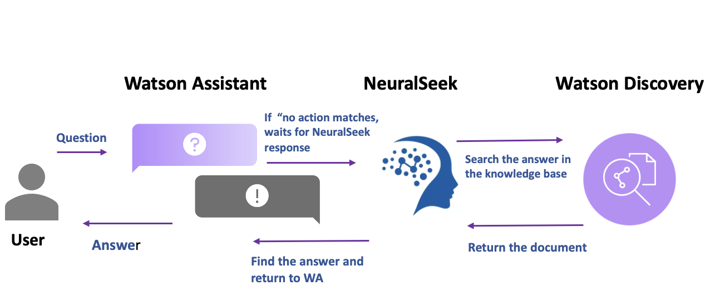
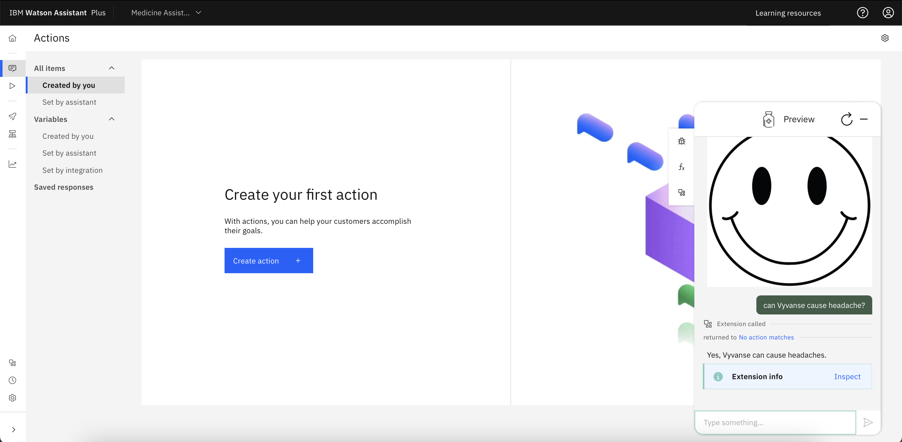

# Watson Assistant API Py

This project is the same, as my Watson Assistant v2.
--> [Watson Assistant v2 in node.js](https://github.com/miucciaknows/Watson-Assistant-API)

In this one, i'm using Python to do an API with Watson Assistant.

I'm going to provide a simple briefly below.

### My Watson Assistant

I have created this Assistant to provide answers about certain medicines. I use **Watson Assistant**, **Watson Discovery**, and **NeuralSeek**, all available on **IBM Cloud**.

**Watson Assistant:** Used to build a virtual agent powered by AI.

**Watson Discovery:** Used to search and answer questions about business documents using custom NLP and Large Language Models from IBM Research.

**NeuralSeek:** Connects an existing knowledge database(in my case, Watson Discovery) and instantly generates natural-language answers to real customer questions.

The integration of **Watson Discovery** and **NeuralSeek** are done within **Watson Assistant**.

This is my Assistant on my **IBM Cloud**, Watson Assistant's instance.

--> Note that i'm using a **Plus plan** on my instance. For use an **extension** with **Watson Assistant**, you will need a **Plus instance** for this.

I sent a question and then got an answer from WA.

### About my Code

#### Debugging

#### Results

### Testing on your Own
